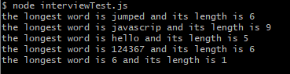

# LongestWord

The class Longestword has a method longword which takes any string and returns the longest word in a string.

The method only takes String input.

Following is the output of test cases:

